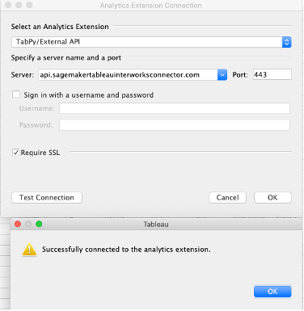
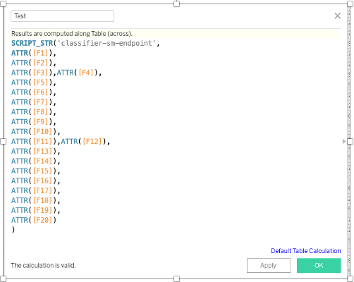

<<<<<<< HEAD
= Additional Information

== Deploy without a VPC

The deployment steps describe how to deploy the solution into an AWS VPC, new or existing. To deploy the solution without a VPC set the parameter "LaunchToVpc" to "No" when launching the Quick Start. 

=======
== Test the deployment
Navigate to the URL for the UserPoolDomain output, and sign up a user
>>>>>>> 178ebbc7cd44f119812dbc3e40f709f633ae3dbb

Sign in to the connector at the Cognito UserPoolDomain with the credentials of your newly provisioned user

=== (Optional) Testing from Tableau

Open Tableau Desktop (Version 2020.1 or newer)

*Help*

*Settings & Performance*

*Manage Analytics Extension Connection*

 - *Server*: _TabPy /External API_
 - *Server*: 
 - *Port*: _443_
 - *Sign in wiht a username and password*: _yes_
 - *Require SSL*: _yes_

[#tableau1]
.Connectivity from Tableau for the _{partner-product-name}_ on AWS
[link=images/tableau_connection.png]

== Best practices for using {partner-product-short-name} on AWS

While using the {partner-product-name} solution, it is important to follow best practices for Tableau Desktop, and Amazon SageMaker. The solution allows Tableau end users to use any ML model that is hosted on Amazon SageMaker through Tableau’s Table Calculations. End users are responsible to pass data from Tableau Table Calculations at the granularity expected by the SageMaker hotsted model (no aggregation, translation, etc).

The {partner-product-name} solution can be called from Tableau’s suite of SCRIPT_ functions (SCRIPT_REAL, SCRIPT_STR, SCRIPT_INT, SCRIPT_BOOL), available inside of Tableau’s calculated fields. The functions allow end users to pass a script along with a block of data to an external analytics engine. The syntax for these calculations is as follows: Script_Function (‘[SageMaker Hosted Endpoint]’, fields in dataset to pass to model)

[#tableau_additionalinfo]
.Calculation Syntax for mapping a data source in Tableau to the input schema of an Amazon SageMaker hosted model.
[link=images/tableau_calculations.png]

Notes about drafting calculations:

<<<<<<< HEAD
- Script Functions – the function you use in your calculated field must match the return data type of your SageMaker model.
- SageMaker Hosted Endpoint – the SageMaker model must have a hosted endpoint to use the solution.
- Fields to pass to model – you must pass from Tableau each field in the dataset, in order, that the SageMaker model is expecting.
=======
* Script Functions – the function you use in your calculated field must match the return data type of your SageMaker model.
* SageMaker Hosted Endpoint – the SageMaker model must have a hosted endpoint to use the connector.
* Fields to pass to model – you must pass from Tableau each field in the dataset, in order, that the SageMaker model is expecting.
>>>>>>> 178ebbc7cd44f119812dbc3e40f709f633ae3dbb

== Customization

It is recommended for users of the {partner-product-name} solution to use Amazon SageMaker Autopilot to train models, in the event that you are not using an Autopilot trained model it is possible the solution will require customizations. The solution utilizes a Lambda function to translate the Tableau Analytics Extension API call to a format that is compatible with SageMaker endpoints trained with AutoPilot. In the event that you need to apply customizations to the solution, follow these steps.

Tableau sends data from the extension in the following format:

.Tableau Analytics Extension Data Format
[source,json]
----
{'_arg1': [37, 40, 56, 45, 46, 55, 52, 45], '_arg2': ['services', 'admin.', 'services', 'services', 'blue-collar', 'retired', 'technician', 'blue-collar'], '_arg3': ['married', 'married', 'married', 'married', 'married', 'single', 'married', 'married'], '_arg4': ['high.school', 'basic.6y', 'high.school', 'basic.9y', 'basic.6y', 'high.school', 'basic.9y', 'basic.9y'], '_arg5': ['no', 'no', 'no', 'unknown', 'unknown', 'no', 'no', 'no'], '_arg6': ['yes', 'no', 'no', 'no', 'yes', 'yes', 'yes', 'yes'], '_arg7': ['no', 'no', 'yes', 'no', 'yes', 'no', 'no', 'no'], '_arg8': ['telephone', 'telephone', 'telephone', 'telephone', 'telephone', 'telephone', 'telephone', 'telephone'], '_arg9': ['may', 'may', 'may', 'may', 'may', 'may', 'may', 'may'], '_arg10': ['mon', 'mon', 'mon', 'mon', 'mon', 'mon', 'mon', 'mon'], '_arg11': [226, 151, 307, 198, 440, 342, 1666, 225], '_arg12': [1, 1, 1, 1, 1, 1, 1, 2], '_arg13': [999, 999, 999, 999, 999, 999, 999, 999], '_arg14': [0, 0, 0, 0, 0, 0, 0, 0], '_arg15': ['nonexistent', 'nonexistent', 'nonexistent', 'nonexistent', 'nonexistent', 'nonexistent', 'nonexistent', 'nonexistent'], '_arg16': [1.1, 1.1, 1.1, 1.1, 1.1, 1.1, 1.1, 1.1], '_arg17': [93.994, 93.994, 93.994, 93.994, 93.994, 93.994, 93.994, 93.994], '_arg18': [-36.4, -36.4, -36.4, -36.4, -36.4, -36.4, -36.4, -36.4], '_arg19': [4.857, 4.857, 4.857, 4.857, 4.857, 4.857, 4.857, 4.857], '_arg20': [5191, 5191, 5191, 5191, 5191, 5191, 5191, 5191]}
----

In the CloudFormation pane showing the solution's resources, navigate to the Evaluate Lambda Function. 

The Evaluate Lambda Function is authored in Python 3.7, and contains a function titled "create_sagemaker_body". This function facilitates transformation of Tableau's JSON, into the following output (text/csv) to be sent to the Amazon SageMaker endpoint. 

.Formatted Data for SageMaker AutoPilot trained model
[source,csv]
----
37,services,married,high.school,no,yes,no,telephone,may,mon,226,1,999,0,nonexistent,1.1,93.994,-36.4,4.857,5191
40,admin.,married,basic.6y,no,no,no,telephone,may,mon,151,1,999,0,nonexistent,1.1,93.994,-36.4,4.857,5191
56,services,married,high.school,no,no,yes,telephone,may,mon,307,1,999,0,nonexistent,1.1,93.994,-36.4,4.857,5191
45,services,married,basic.9y,unknown,no,no,telephone,may,mon,198,1,999,0,nonexistent,1.1,93.994,-36.4,4.857,5191
46,blue-collar,married,basic.6y,unknown,yes,yes,telephone,may,mon,440,1,999,0,nonexistent,1.1,93.994,-36.4,4.857,5191
55,retired,single,high.school,no,yes,no,telephone,may,mon,342,1,999,0,nonexistent,1.1,93.994,-36.4,4.857,5191
52,technician,married,basic.9y,no,yes,no,telephone,may,mon,1666,1,999,0,nonexistent,1.1,93.994,-36.4,4.857,5191
45,blue-collar,married,basic.9y,no,yes,no,telephone,may,mon,225,2,999,0,nonexistent,1.1,93.994,-36.4,4.857,5191
----

In the event that your ML model requires additional transformations, it is not recommended to modify the Lambda functions code. It is best practice to package input pre-processing logic alongside the ML model as an Amazon SageMaker inference pipeline as described in https://aws.amazon.com/blogs/machine-learning/preprocess-input-data-before-making-predictions-using-amazon-sagemaker-inference-pipelines-and-scikit-learn/[this blog^]. The input pre-processing logic is responsible for transforming the data format that the Lambda function sends to the SageMaker model endpoint into the format required by the ML model. This allows for additional transformations and presents the opportunity to easily integrate customizations into the functionality of the {partner-product-name} solution. 

== Other useful information
=== AWS services
* http://aws.amazon.com/documentation/cloudformation/[AWS CloudFormation]
* https://docs.aws.amazon.com/apigateway/[Amazon API Gateway]
* https://docs.aws.amazon.com/lambda/[AWS Lambda]
* https://docs.aws.amazon.com/cognito/[Amazon Cognito]