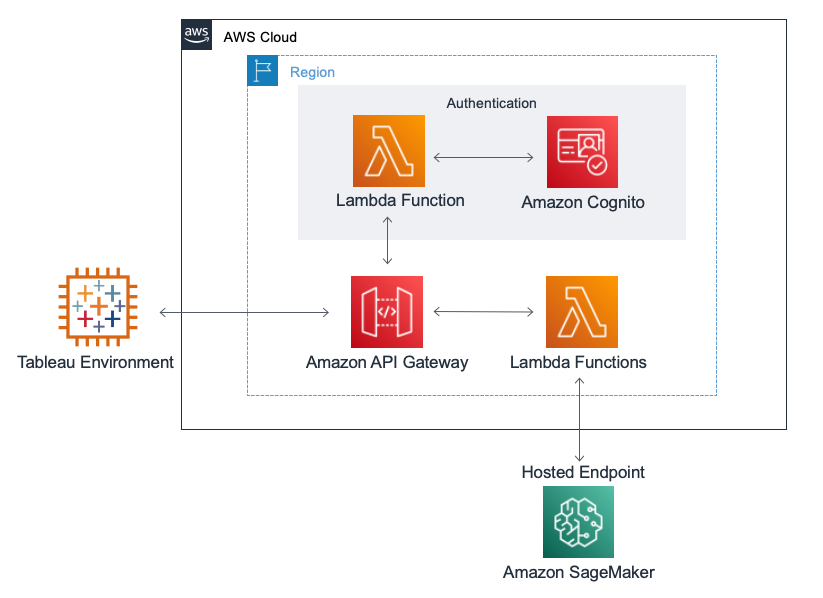

Deploying this Quick Start for a new virtual private cloud (VPC) with
default parameters builds the following {partner-product-short-name} environment in the
AWS Cloud.

// Replace this example diagram with your own. Send us your source PowerPoint file. Be sure to follow our guidelines here : http://(we should include these points on our contributors giude)
:xrefstyle: short
[#architecture1]
.Quick Start architecture for {partner-product-short-name} on AWS

As shown in <<architecture1>>, the Quick Start sets up the following:

* AWS Lambda functions
* Amazon Cognito 
* Amazon API Gateway

In the Authentication section the Quick Start creates the following:

* An AWS Lambda Authorizer function that connects Amazon API Gateway to Amazon Cognito User Pools for basic authentication.
* A Cognito User Pool with a managed portal for sign up & sign in of users.

Additionally, the Quick Start creates the following:

* A REST API in Amazon API Gateway that contains two endpoints, info and evaluate to facilitate communication with Tableau and Amazon SageMaker. 
* Two AWS Lambda functions, one for the info endpoint, and one for the evaluate endpoint. 
