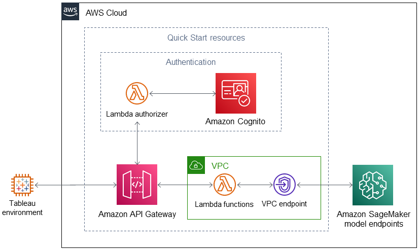

Deploying this Quick Start into a new virtual private cloud (VPC) with default parameters builds the following {partner-product-name} environment in the AWS Cloud.

:xrefstyle: short
[#architecture1]
.Quick Start architecture for Amazon SageMaker AutoPilot Tableau Connector on AWS
[link=images/tableau-sagemaker-endpoint-architecture-diagram.png]

As shown in <<architecture1>>, this Quick Start sets up the following:

* A VPC configured according to AWS best practices to provide you with your own virtual network on AWS.
* Amazon API Gateway to maintain and secure a REST API containing two endpoints (info and evaluate). The API facilitates connection between Tableau and Amazon SageMaker Autopilot. Together with AWS Lambda, API Gateway forms the app-facing part of the deployed AWS serverless infrastructure.
* In the Authentication group:
 - An API Gateway Lambda authorizer to control access to REST API resources. When Tableau calls the REST API, API Gateway invokes the Lambda authorizer to validate the caller.
 - Amazon Cognito providing a managed portal for sign-up and sign-in and a user pool to authenticate users.
* Two AWS Lambda functions, one for each API Gateway endpoint. When Tableau sends a request to an endpoint (for example, to retrieve a SageMaker inference) API Gateway calls the associated Lambda function.
