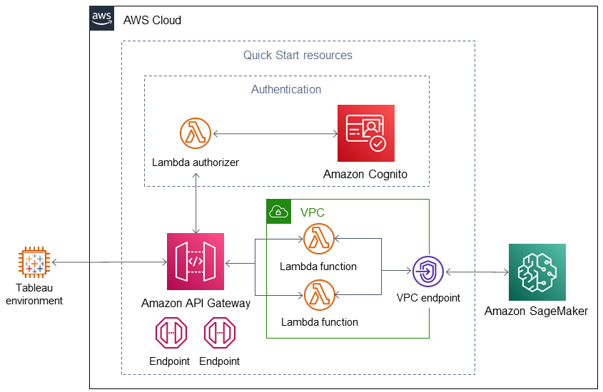

Deploying this Quick Start into a new virtual private cloud (VPC) using the default parameters builds the following serverless environment in the AWS Cloud:

:xrefstyle: short
[#architecture1]
.Quick Start architecture for {{partner-product-name}} on AWS
[link=images/tableau-sagemaker-endpoint-architecture-diagram.png]

As shown in <<architecture1>>, this Quick Start sets up the following:

* In the authentication group:
** Amazon Cognito to provide a managed portal for sign-up and sign-in of connector users and a user pool for authentication.
** An Amazon API Gateway lambda authorizer to connect API Gateway to the Amazon Cognito user pool.
* Amazon API Gateway with REST API containing endpoints (GET /info and POST /evaluate). 
* A VPC, configured according to AWS best practices, to provide you with your own virtual network on AWS.*
* In the VPC:
** Two lambda functions, one for each REST API endpoint.
** A VPC endpoint to connect the VPC and SageMaker.

*The template that deploys the Quick Start into an existing VPC skips the components marked by asterisks and prompts you for your existing VPC configuration.