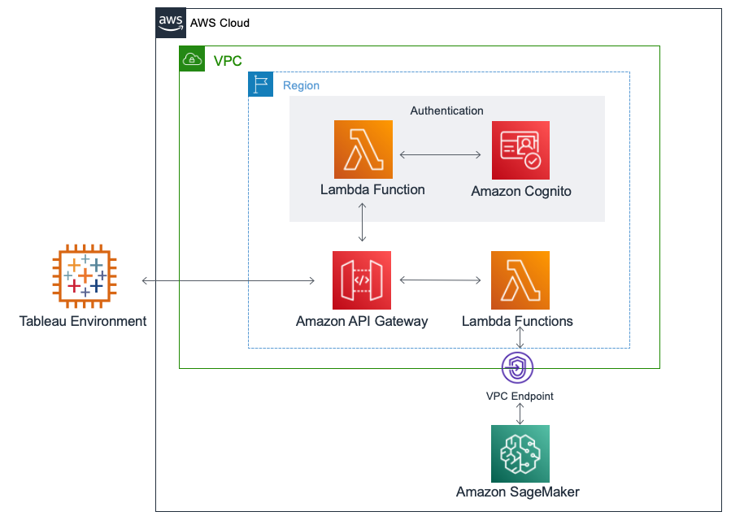

This option deploys the {partner-product-name} into an existing VPC in the AWS Region you choose when you deploy the Quick Start. Figure 2 shows the standalone architecture. 

[#architecture_existing_vpc]
.VPC Quick Start architecture for _{partner-product-name}_ on AWS
[link=images/vpc_architecture_diagram.png]

=== Step 1. Prepare an AWS Account

. If you don’t already have an AWS account, create one at http://aws.amazon.com by following the on-screen instructions. 

. Use the Region selector in the navigation bar to choose the AWS Region where you want to deploy the Quick Start on AWS. Deploy the Quick Start to the same Region where your SageMaker AutoPilot models are deployed. If you have SageMaker AutoPilot models deployed to multiple Regions, the recommended architecture is to deploy an instance of the connector to each Region. 

. Create an SSL Certificate in the us-east-1 region. To do this, refer to https://docs.aws.amazon.com/acm/latest/userguide/gs-acm-request-public.html#request-public-console[Request a Public Certificate Using the Console]. 

=== Step 2. Launch the Quick Start

This AWS CloudFormation stack takes approximately 20 minutes to create. This template is launched in the US-West (Oregon) region by default. You can change the region to match what you selected in step 1 by using the region selector in the navigation bar. You can also download the templates to use as a starting point for your own implementation. 

When you finish customizing the parameters, choose Next. 

Submit your VPC details into the relevant parameters to ensure launch into the VPC is successful. 

On the Options page, specify tags (key-value pairs) for resources in your stack and set advanced options. When you’re done, choose Next. 

On the Review page, review and confirm the template settings. Under Capabilities, acknowledge that the template will create IAM resources. 

Choose Create to deploy the stack

Monitor the status of the stack. When the status is CREATE_COMPLETE, the deployment is complete. 

Navigate to the Resources section and find the SolutionSG Security Group. This Security Group is open to the world by default, after testing successful deployment of the solution modify the inbound & outbound rules here to ensure they are in line with security policies for your VPC. 

Use the information displayed in the Outputs tab for the stack to view the resources that were created. The AWS CloudFormation template for {partner-product-name} creates the following outputs:

 - _UserPoolDomain_ – A URL for Cognito to sign up & sign in users of the solution
 - _SageMakerTableauApi_ – A URL for users to connect to the solution from Tableau

=== Step 3. Test the Deployment

Navigate to the URL for the UserPoolDomain output, and sign up a user

Sign in to the solution at the Cognito UserPoolDomain with the credentials of your newly provisioned user

=== Step 4. (Optional) Testing from Tableau

Open Tableau Desktop (Version 2020.1 or newer)

*Help*

*Settings & Performance*

*Manage Analytics Extension Connection*

 - *Server*: _TabPy /External API_
 - *Server*: 
 - *Port*: _443_
 - *Sign in with a username and password*: _yes_
 - *Require SSL*: _yes_

[#tableau2]
.Connectivity from Tableau for the _{partner-product-name}_ on AWS
[link=images/tableau_connection.png]
image::../images/tableau_connection.png[TableauConnection]
